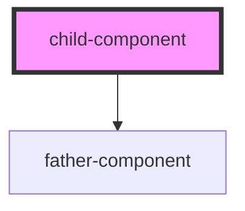

# child-component

<!-- Auto Generated Below -->

## Dependencies

### Depends on

- [father-component](../father-component)

### Graph

----------------------------------------------

*Built with [StencilJS](https://stenciljs.com/)*
