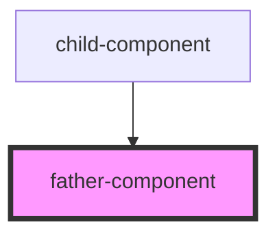

# father-component

<!-- Auto Generated Below -->

## Properties

| Property | Attribute | Description | Type     | Default  |
| -------- | --------- | ----------- | -------- | -------- |
| `color`  | `color`   |             | `string` | `'blue'` |

## Dependencies

### Used by

 - [child-component](../child-component)

### Graph

----------------------------------------------

*Built with [StencilJS](https://stenciljs.com/)*
